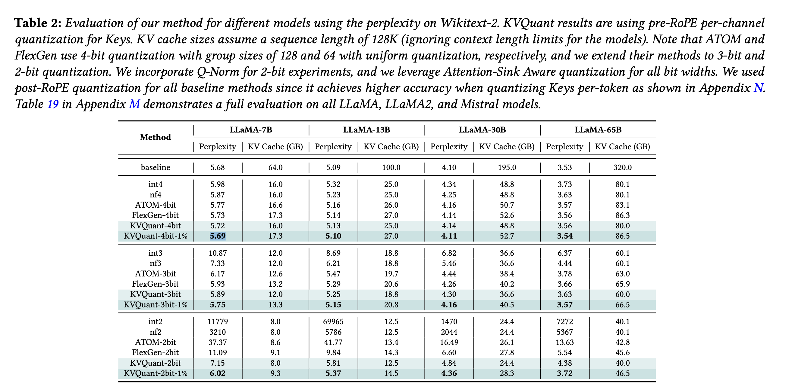

## Step 1: Gradient Computation Folder
- Can download Huggingface-compatible LLaMA models with the created `downloadModel.py`.
- The models I downloaded are the ones they used in experiment session in their paper.
    - As quoated from their Abstract: 
    - > Our method enables serving LLaMA-7B with a context length of up to 1 million on a single A100-80GB GPU and up to 10 million on an 8-GPU system. We develop custom CUDA kernels for KVQuant, showing that we can achieve up to ∼1.4× speedups, compared to baseline fp16 matrix-vector multiplications, for the LLaMA-7B model.
- All the HuggingFace models should be downloaded into directory `~/.cache/huggingface/hub/`.
- The command is `CUDA_VISIBLE_DEVICES=0,1 python run-fisher.py --model_name_or_path ~/.cache/huggingface/hub/models--huggyllama--llama-7b/snapshots/8416d3fefb0cb3ff5775a7b13c1692d10ff1aa16/ --output_dir reproduceOutput --dataset wikitext2 --seqlen 2048 --maxseqlen 2048 --num_examples 16`
    - Note 1: `CUDA_VISIBLE_DEVICES=0,1` distributes the model into 2 A40 GPUs.
    - Note 2: `reproduceOutput` is the directory I created to store outputs.

## Step 2: Quant Folder
1.  Run their quantization and evaluation. Quantize the __LLaMA-7B__ model using nuq4-1%:
`
CUDA_VISIBLE_DEVICES=0 python llama_simquant.py ~/.cache/huggingface/hub/models--huggyllama--llama-7b/snapshots/8416d3fefb0cb3ff5775a7b13c1692d10ff1aa16/ --abits 4 --nsamples 16 --seqlen 2048 --nuq --fisher ../gradients/reproduceOutput --quantize --include_sparse --sparsity-threshold 0.99 --quantizer-path quantizers.pickle ;
` 
Note: in the "nature server", it takes 1-2 hour2 to complete this command.
2. Evaluate with quantizer using nuq4-1%: `CUDA_VISIBLE_DEVICES=0 python llama_simquant.py ~/.cache/huggingface/hub/models--huggyllama--llama-7b/snapshots/8416d3fefb0cb3ff5775a7b13c1692d10ff1aa16/ --abits 4 --nsamples 16 --seqlen 2048 --nuq --include_sparse --sparsity-threshold 0.99 --quantizer-path quantizers.pickle ;` 
Result is __5.7016__, which coincide with the result in the Figure 2 in their paper as shown below. 

